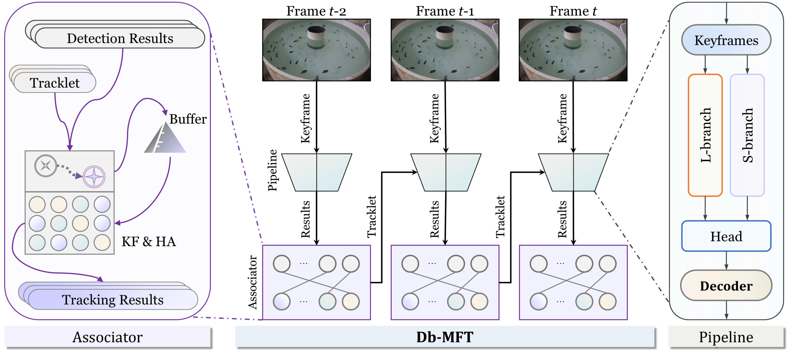
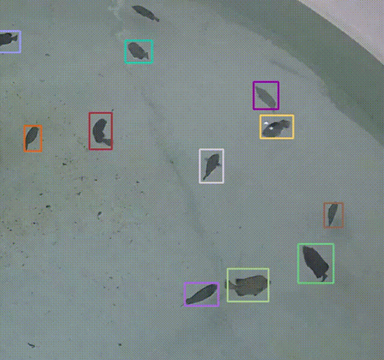
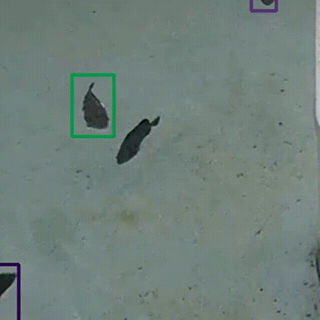

<div align="center">

# Db-MFT: An Efficient and Accurate Dual-Branch Framework for Multiple Fish Tracking

**The official implementation of the paper:**
> [**Db-MFT: An Efficient and Accurate Dual-Branch Framework for Multiple Fish Tracking**](##TODO:LINK_TO_PAPER##)  
> *Weiran Li, Yeqiang Liu, Yiying Sheng, Enyu Yang, Hwa Liang Leo, Zhenbo Li\**
> ### [📄 Paper](##TODO:LINK_TO_PAPER##) | [💻 Code](https://github.com/vranlee/Db-MFT) | [📊 Datasets](https://github.com/vranlee/MFT_DATASETS)

</div>

<p align="center">
  
</p>
<p align="center">
  
   
</p>

---

<p align="center">
  For questions, please contact us at <code>vranlee@cau.edu.cn</code> or <code>weiranli@u.nus.edu</code>.
</p>

---

## 🚀 Updates
- **[2025.09.16]** &mdash; The repository has been updated to align with our revised manuscript. All resources, including new terminology and concepts, are now synchronized.
- **[2024.07.22]** &mdash; Repository initialized.

## ✨ Abstract
Tracking fish is challenging due to their lack of distinctive features, rapid deformations, and frequent occlusions in dense schools, which renders traditional methods ineffective. To address this, we propose **Db-MFT**, a **D**ual-**b**ranch **M**ultiple **F**ish **T**racking framework with adaptive geometric correspondence, designed for both efficiency and accuracy. The framework features a hybrid extractor with density map regression to improve robustness against occlusions and a flexible dual-branch design: a **Lightweight branch (L-branch)** for resource-constrained deployment and a **Scalable branch (S-branch)** for high-precision analysis. Additionally, we introduce a minimalistic **Adaptive Geometric Correspondence IoU (AGCIoU)** association mechanism. This approach simplifies the paradigm by replacing complex appearance-based Re-ID modules with a lightweight yet robust algorithm based on spatial and geometric cues, effectively maintaining identities through severe occlusions. Db-MFT establishes a new state-of-the-art by demonstrating a superior accuracy-efficiency trade-off, spanning from a top HOTA score of **29.98** in its high-accuracy configuration to a highly efficient **20.47G FLOPs** in its lightweight configuration.

## 🏆 Key Contributions
*   **Flexible Dual-Branch Architecture:** Db-MFT offers a novel framework that masterfully balances tracking accuracy and computational efficiency for diverse application scenarios.
*   **Minimalistic Geometric Association:** We introduce **AGCIoU**, an association module that ensures robust ID matching through severe occlusions *without* requiring a separate, computationally expensive Re-ID network.
*   **State-of-the-Art Performance:** Our framework establishes a new SOTA on the MFT24 dataset with a peak HOTA of 29.98, while the lightweight configuration reduces computational cost by **38.7-fold** compared to prominent trackers.

## 📊 Tracking Performance

### State-of-the-Art Comparison on MFT24 Dataset

| Method                 | Params ↓   | FLOPs ↓   | HOTA ↑   | IDF1 ↑   | MOTA ↑   | IDs ↓   |
|------------------------|------------|-----------|----------|----------|----------|---------|
| SORT†                  | 99.00M     | 793.21G   | 22.73    | 23.91    | 48.67    | 2599    |
| ByteTrack†             | 99.00M     | 793.21G   | 19.18    | 19.37    | 40.17    | 2325    |
| OC-SORT†               | 99.00M     | 793.21G   | 22.99    | 24.14    | 48.44    | 2674    |
| FairMOT                | 16.55M     | 72.93G    | 27.26    | 29.68    | 60.74    | 2456    |
| CMFTNet                | 45.08M     | 137.77G   | 27.08    | 29.93    | **61.90**| 2716    |
| TrackFormer            | 42.95M     | 143.43G   | 26.51    | 26.73    | 43.42    | 899     |
| **Db-MFT-L (Ours)**    | **5.79M**  | **20.47G**| 28.43    | 36.29    | 47.84    | 574     |
| **Db-MFT-S (Ours)**    | 32.59M     | 90.13G    | **29.98**| **39.01**| 54.74    | 908     |

<details>
<summary><b>Click to see the full comparison table</b></summary>

| **Methods**          | **Params ↓** | **FLOPs ↓** | **HOTA ↑** | **IDF1 ↑** | **IDP ↑** | **IDR ↑** | **DetRe ↑** | **DetPr ↑** | **IDs ↓** | **MOTA ↑** | **MOTP ↑** |
|-----------------------|--------------|-------------|------------|------------|-----------|-----------|-------------|-------------|-----------|------------|------------|
| SORT†          | 99.00M       | 793.21G     | 22.73      | 23.91      | 29.09     | 20.29     | 44.66       | 64.03       | 2599      | 48.67      | 72.01      |
| ByteTrack†     | 99.00M       | 793.21G     | 19.18      | 19.37      | 26.11     | 15.40     | 35.66       | 60.46       | 2325      | 40.17      | 67.99      |
| OC-SORT†       | 99.00M       | 793.21G     | 22.99      | 24.14      | 29.28     | 20.54     | 44.84       | 63.92       | 2674      | 48.44      | 72.17      |
| HybridSORT†    | 99.00M       | 793.21G     | 15.89      | 17.29      | **56.77** | 10.20     | 11.79       | 65.58       | **214**   | 14.23      | 71.64      |
| QDTrack              | 57.20M       | 32.02G      | 25.27      | 24.49      | 27.74     | 21.93     | **53.70**   | 67.92       | 9103      | 42.81      | 75.34      |
| FairMOT              | 16.55M       | 72.93G      | 27.26      | 29.68      | 36.56     | 24.98     | 46.71       | **68.36**   | 2456      | 60.74      | 69.59      |
| CMFTNet              | 45.08M       | 137.77G     | 27.08      | 29.93      | 36.35     | 25.43     | 47.52       | 67.93       | 2716      | **61.90**  | 69.47      |
| TrackFormer          | 42.95M       | 143.43G     | 26.51      | 26.73      | 35.69     | 21.36     | 42.04       | 70.23       | 899       | 43.42      | **76.00**  |
| CenterTrack          | 16.67M       | 61.36G      | 22.49      | 23.39      | 30.90     | 18.81     | 35.11       | 57.67       | 1032      | 26.68      | 68.48      |
| TransCenter          | 30.66M       | 133.09G     | 27.20      | 29.48      | 37.05     | 24.48     | 38.22       | 57.85       | 597       | 24.69      | 73.83      |
| TFMFT                | 39.93M       | 215.27G     | 21.88      | 26.74      | 45.55     | 18.92     | 29.72       | 71.54       | 945       | 35.65      | 74.89      |
| **Db-MFT-L (Ours)**  | **5.79M**    | **20.47G**  | 28.43      | 36.29      | 49.44     | 28.67     | 37.34       | 64.41       | 574       | 47.84      | 67.17      |
| **Db-MFT-S (Ours)**  | 32.59M       | 90.13G      | **29.98**  | **39.01**  | 47.87     | **32.92** | 42.86       | 62.32       | 908       | 54.74      | 65.82      |

</details>

*Notes: † indicates SDE-based methods using shared weights. -S/-L denote the Scalable and Lightweight branches of Db-MFT, respectively.*

## 🔧 Installation

**Step 1: Clone the repository**
```bash
git clone https://github.com/vranlee/Db-MFT.git
cd Db-MFT
```

**Step 2: Create conda environment and install dependencies**  
We recommend `python=3.8` and `pytorch=1.7.0` (with `cudatoolkit=11.0`).
```bash
conda env create -f environment.yml
conda activate db_mft
```

## 📦 Pretrained Models
Our pretrained models for both the Scalable (S) and Lightweight (L) branches can be downloaded from:
- **[Baidu Netdisk]**(https://pan.baidu.com/s/13GmVd6hYM38xzvnb2Sr83A?pwd=5uap) (Access Code: `5uap`)
- **[Google Drive]**(##TODO:ADD_GDRIVE_LINK##)
- **[Hugging Face]**(##TODO:ADD_HF_LINK##)

## ⚡ Quick Start: Training & Evaluation

1.  **Download Datasets:** Download the MFT24 dataset from our [MFT Datasets Repository](https://github.com/vranlee/MFT_DATASETS/) and place it in the appropriate directory.

2.  **Configure Paths:** Modify the paths in the training script `experiments/exp.sh` to point to your dataset and desired output directories.

3.  **Run Experiment:**
    ```bash
    sh experiments/exp.sh
    ```
This script will handle both the training and evaluation process.

## 🙏 Acknowledgements
Our work builds upon several fantastic open-source projects. We are grateful for their contributions.
*   [FairMOT](https://github.com/ifzhang/FairMOT)
*   [ByteTrack](https://github.com/ifzhang/ByteTrack)
*   [CountingMOT](https://github.com/weihong9/CountingMOT)

## 📜 Citation
(##TODO:ADD_CITE##)
```
